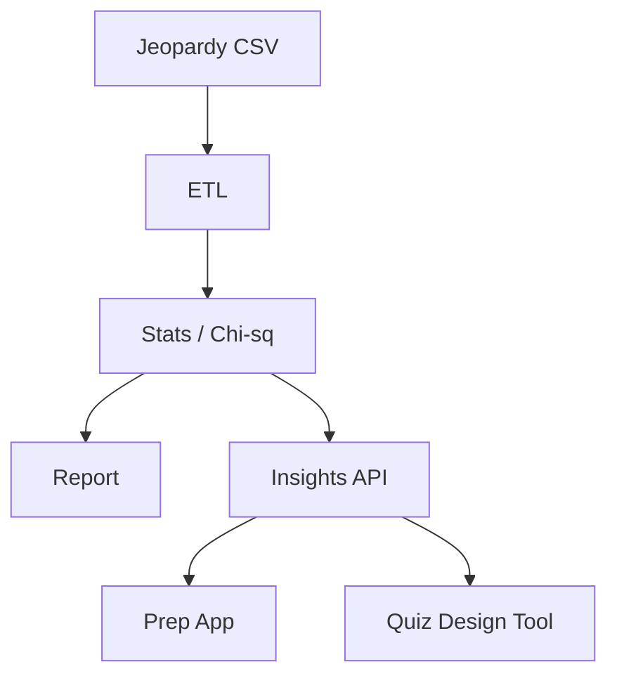

# Operationalization: Jeopardy Prep Insights

## Architecture

## Target user and value proposition

**Target users:** Trivia creators, quiz designers, or Jeopardy enthusiasts who want data-driven insights (answer-in-question rates, term-value associations, question overlap).

**Value proposition:** Expose summary statistics and chi-squared results via a small API or dashboard so users can explore which terms or patterns correlate with high-value questions and refine question design.

**Deployment:** (1) Run `run.py` periodically on updated CSV; publish summary JSON or HTML. (2) Optional API: endpoint that returns answer_in_question mean, overlap stats, and term chi-squared table for a given dataset path or version.

## Next steps

1. **Add Bonferroni (or FDR) correction** when reporting chi-squared for many terms.
2. **Dashboard:** Simple Streamlit or static HTML with tables and short interpretations.
3. **Refresh data:** Document how to refresh jeopardy.csv (e.g. j-archive export) and re-run pipeline.
