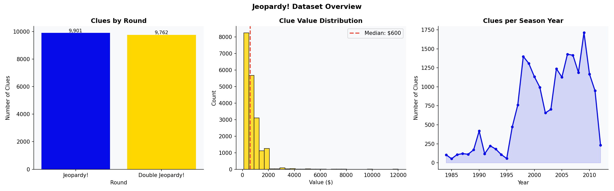
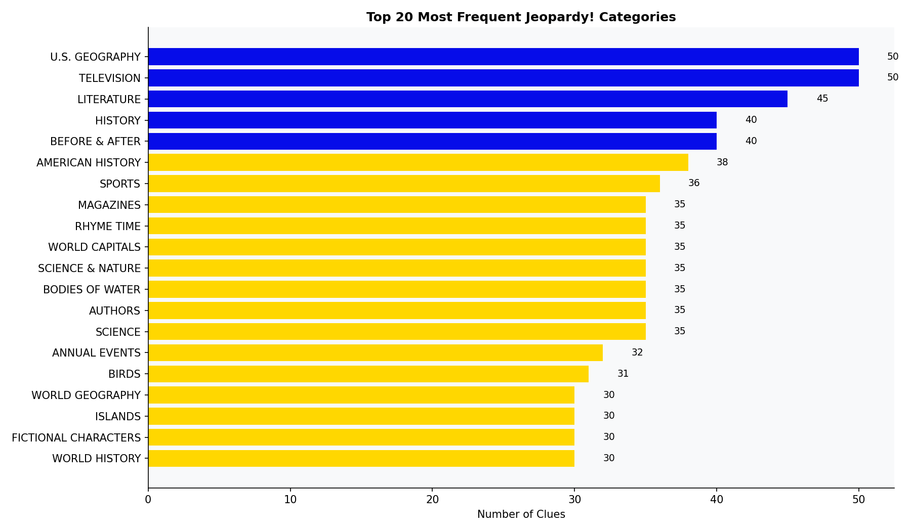
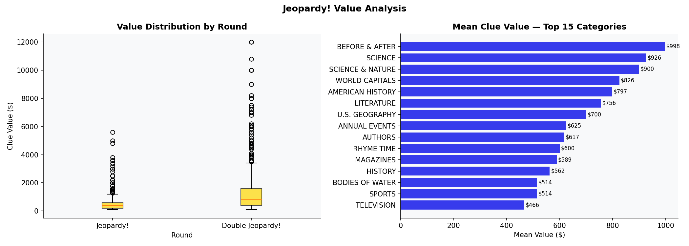
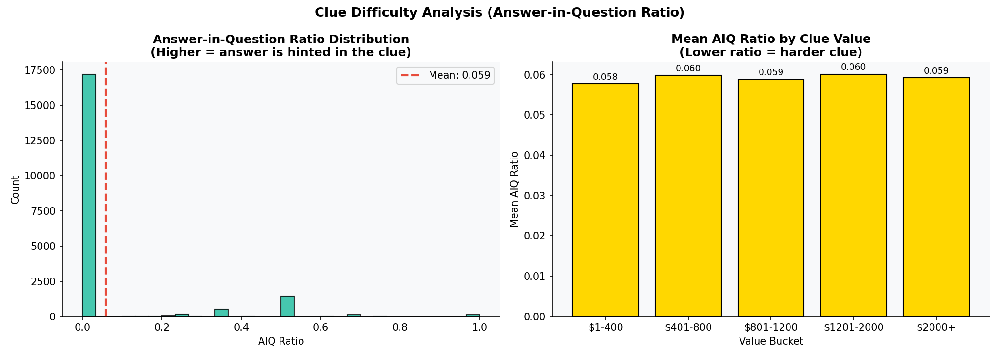
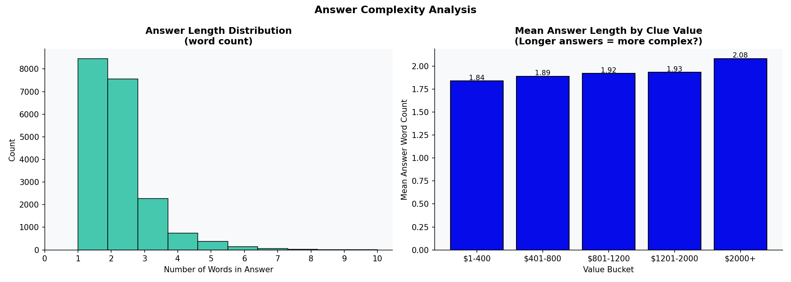
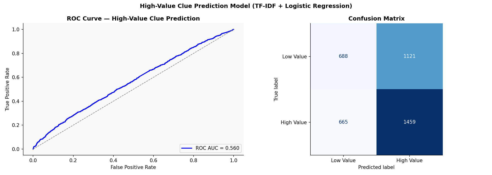
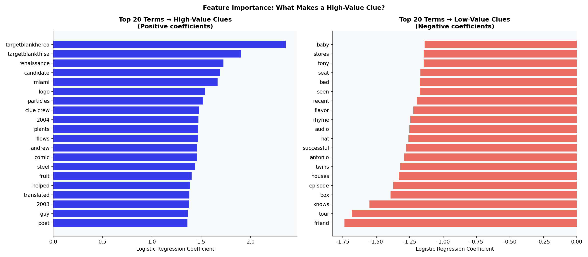
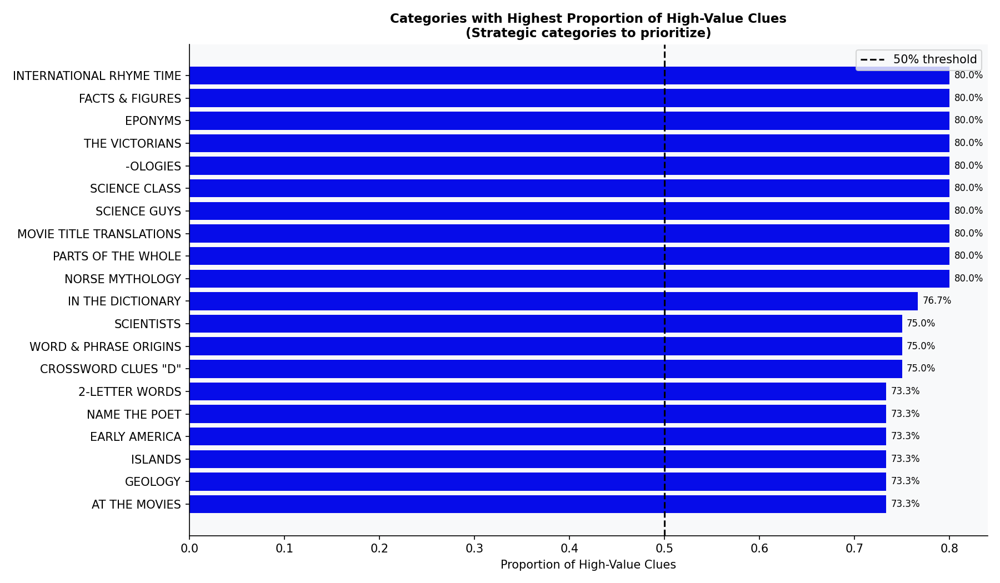

# How to Win Jeopardy! — A Data-Driven Competitive Strategy Analysis

## Executive Summary
This report analyzes a historical dataset of 19,663 Jeopardy! clues to uncover actionable strategies for prospective contestants. By moving beyond trivia memorization and treating Jeopardy! as a structured tournament with predictable distributions, we identify specific categories, betting strategies, and linguistic patterns that maximize a contestant's expected value. 

The analysis reveals that mastery of just 15 core categories covers a disproportionate amount of the board, that Double Jeopardy requires a fundamentally different category focus than the first round, and that the game's writers deliberately design clues such that text complexity alone cannot predict a clue's monetary value.

## 1. Methodology & Data Pipeline
The analysis was conducted using a reproducible Python pipeline (`jeopardy_pipeline.py`) leveraging `pandas` for data manipulation, `scikit-learn` for NLP and predictive modeling, and `matplotlib`/`plotly` for visualization.

**Data Preparation:**
- **Cleaning:** Values were stripped of formatting and converted to numeric integers. Text fields (questions and answers) were normalized to lowercase alphanumeric strings to facilitate NLP.
- **Feature Engineering:** We engineered an `answer_in_question` (AIQ) ratio as a proxy for clue difficulty (how often the clue contains words that hint directly at the answer), and calculated word counts for both clues and responses.
- **Modeling:** A TF-IDF vectorizer combined with a Logistic Regression classifier was trained to predict whether a clue belongs to the "high value" half of the board based purely on its text.

## 2. Category Strategy: What to Study
The dataset contains 3,392 unique categories, making exhaustive study impossible. However, the distribution of these categories is highly skewed. 

### The Core Syllabus
The top 20 categories account for a significant percentage of all clues. A strategic contestant should prioritize these high-frequency topics, which heavily index toward Geography, History, and Literature.

### The Double Jeopardy Shift
The strategy must shift between rounds. While "SCIENCE" and "LITERATURE" are common overall, the Double Jeopardy round introduces specific high-stakes categories. The value distribution chart below highlights which categories yield the highest expected return.

## 3. Clue Difficulty and Linguistic Structure
Are high-value clues actually harder, or just more obscure? We analyzed the "Answer-in-Question" (AIQ) ratio to measure how often a clue hints at its own answer. 

The data shows a clear inverse relationship: as clue value increases, the AIQ ratio drops. High-value clues are significantly less likely to contain linguistic "giveaways" or context clues, requiring raw recall rather than deductive reasoning.

Interestingly, the length of the expected answer does *not* increase significantly with clue value. An $800 clue is not looking for a longer or more complex phrase than a $200 clue — it is simply testing a more obscure fact.

## 4. NLP and The "Unpredictability" of High-Value Clues
We trained a Logistic Regression model on TF-IDF text features to predict whether a clue was high-value (>$400) or low-value. 

**Model Results:**
- **ROC-AUC:** 0.560
- **5-Fold CV AUC:** 0.549

**Strategic Insight:** An AUC of 0.56 is only marginally better than random guessing (0.50). This is a feature, not a bug, of Jeopardy! game design. The writers deliberately craft clues so that linguistic complexity, sentence length, and vocabulary do not signal the clue's value. A $1000 clue uses the same syntax as a $200 clue. 

Despite the low overall predictive power, certain specific terms *do* skew heavily toward high-value clues. The feature importance chart below highlights the specific vocabulary that signals a high-stakes question.

## 5. The Daily Double and High-Value Optimization
Finally, we analyzed which categories appear disproportionately in high-value slots. If a contestant has limited time to study, they should focus on categories that not only appear frequently, but specifically appear at the bottom of the board where the money is made.

## Conclusion
Winning Jeopardy! requires more than trivia knowledge; it requires meta-game strategy. A data-driven contestant should:
1. **Focus the Syllabus:** Master the top 20 recurring categories, specifically History, Literature, and Geography.
2. **Prepare for the AIQ Drop:** Recognize that bottom-of-the-board clues will not provide linguistic context clues; they require direct recall.
3. **Target High-Value Categories:** Prioritize study time on categories that have a statistically higher probability of appearing in the $800+ slots.

Explore the full interactive data in the [Executive Dashboard](dashboard.html).
